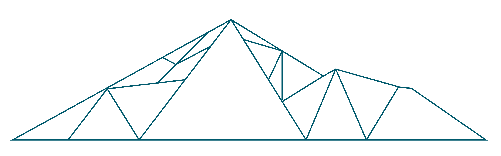
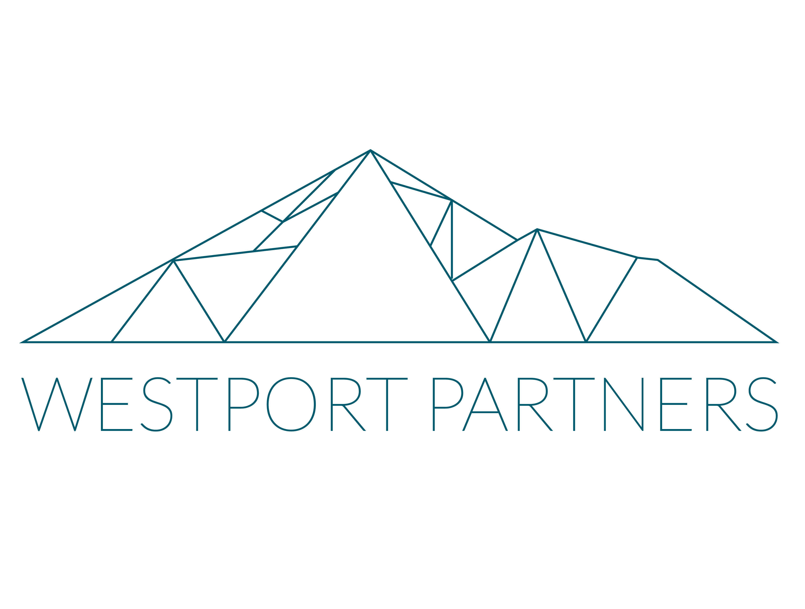

<p align="center">
  
</p>

<h1 align="center">Relay</h1>

<p align="center">
  <strong>Open-source incident orchestration for AWS — the Incident Manager replacement you run yourself.</strong>
</p>

<p align="center">
  <a href="https://github.com/Westport-Partners/relay/actions/workflows/ci.yml"></a>
  <a href="LICENSE"></a>
  
  
  <a href="https://www.westportpartners.com/"></a>
</p>

---

AWS Systems Manager **Incident Manager is end-of-life** (closed to new customers 2025-11-07).
Relay is a lightweight, **AWS-native, self-hosted** replacement that supplies only the
orchestration layer AWS abandoned: **on-call scheduling, escalation policies, dual-stream
incident routing, and a live fleet dashboard.** Everything else — alarm detection, runbook
automation, SMS/email transport, incident records, ticketing — stays on the AWS services and
enterprise systems that already do it well.

You deploy Relay into **your own AWS accounts**. It never phones home. There's nothing to buy
and no SaaS contract — it's Apache-2.0 open source.

> **An open-source project by [Westport Partners](https://www.westportpartners.com/).** Built
> from real-world operation of hundreds of applications on AWS, and designed around the
> constraints regulated and government environments actually have (account isolation, locked-down
> IAM, network segmentation).

**Docs:** [Architecture](docs/architecture.md) · [Install](docs/install.md) ·
[Deploy](docs/deploy.md) · [Locked-down / BYOR](docs/byor.md) · [Configure](docs/configure.md) ·
[Operate](docs/operate.md) · [Scheduling](docs/scheduling.md) ·
[Integrations & AI](docs/integrations.md) · [Feature status](docs/status.md)

---

## What it is

Relay runs as **one always-on container** (ECS Fargate in AWS, or anywhere you can run a
container). An incident's entire life happens in that one process and is visible in one log
stream:

```
  CloudWatch alarm
        │   one EventBridge rule (every alarm, no per-alarm wiring)
        ▼
     SQS queue ──► relay container ───────────────────────────────────┐
                     │  parse → resolve tags → classify (SEV1–4)       │
                     │  → persist → page on-call (SNS) → tile red      │
                     │  → dispatch to GitLab / ServiceNow / Teams      │
                     │                                                 │
                     │  escalation = durable DynamoDB deadlines,       │
                     │  fired by a 30s sweep loop (survives restarts)  │
                     └─────────────────────────────────────────────────┘
                                       │
                                 ┌─────▼─────┐
                                 │ DynamoDB  │  incidents, escalation deadlines,
                                 │relay-<team>│  contacts, schedule, fleet tiles
                                 └───────────┘
```

There is no cross-process hop on the hot path — detecting an incident and turning its dashboard
tile red is an in-process function call, not a network round-trip. A built-in `POST /ingest/alarm`
endpoint runs the exact same pipeline, so you can reproduce any incident locally without AWS in
the loop. For the full picture see **[docs/architecture.md](docs/architecture.md)**.

---

## Why Relay

- **You own it.** Self-hosted in your accounts; no vendor, no data leaving your boundary.
- **Zero-config CloudWatch.** One EventBridge rule catches *every* alarm — existing and future,
  including Synthetics canaries — with no per-alarm wiring.
- **Installs in locked-down accounts.** A Bring-Your-Own-Role / Bring-Your-Own-VPC mode deploys
  without creating any IAM roles or VPCs — for locked-down environments (common at government
  agencies) where teams can only add inline policies to pre-provisioned roles. The entire IAM
  surface is **one task role + one execution role**. See [docs/byor.md](docs/byor.md).
- **Live fleet big-board.** Every app on one board with liveness detection — a healthy-but-quiet
  app stays green, a truly-silent one goes NO-SIGNAL red.
- **Config as code, no PII in Git.** Escalation policies and routing rules live in Git; contacts
  and generated schedules live in your own DynamoDB. Reproducible, reviewable, auditable.
- **AI-assisted triage (optional).** A briefing pack at alert time and an AI-drafted after-action
  review — always async, always labeled, never gating the page.

---

## Topologies

Relay deploys in two [topologies](docs/deploy.md):

| Topology | What it is |
|---|---|
| **team** (default) | One container + one DynamoDB table in a team's own account. Detection, paging, escalation, and the dashboard all run there. |
| **federated-hub** | The same container image run as an org-wide aggregator / NOC big-board. Team deployments forward SEV1/SEV2 incidents up to it. The federated hub stores no static catalog — it builds the org hierarchy from what teams push up. |

---

## Quickstart

### Install

```bash
curl -fsSL https://raw.githubusercontent.com/Westport-Partners/relay/main/install.sh | bash
```

Add `-s -- --yes` when running non-interactively (piped, no TTY). The installer clones the repo to
`~/relay`, seeds config to `~/.relay/config`, and runs a read-only preflight check against your
AWS account. See [docs/install.md](docs/install.md) for flags, the manual clone path, and updating.

### Deploy a team stack

```bash
git clone https://github.com/Westport-Partners/relay.git && cd relay

# One-time per account/region:
AWS_REGION=us-east-1 ./scripts/relay-bootstrap.sh

# Build + push the container image:
export RELAY_HUB_IMAGE_URI="$(./scripts/relay-build-hub-image.sh | tail -1)"

# Synthesize (review the CloudFormation), then deploy:
RELAY_DEPLOY_TYPE=team RELAY_TEAM_NAME=my-team ./scripts/relay-synth.sh
RELAY_DEPLOY_TYPE=team RELAY_TEAM_NAME=my-team ./scripts/relay-deploy.sh
```

Relay deploys two independent stacks — `RelayDataStack` (DynamoDB + SNS, deploy-once) and
`RelayComputeStack` (the container, ALB, EventBridge rule → SQS ingress) — data first. Every
CloudWatch alarm in your account now flows through Relay automatically, and the dashboard URL is
printed in the stack outputs (`DashboardUrl`). The full workflow, scoped deploys, and the
federated-hub path are in **[docs/deploy.md](docs/deploy.md)**.

### Locked-down accounts (no role creation) — BYOR

Supply your pre-provisioned role ARNs and Relay imports them, creates everything *except* roles,
and prints the exact inline-policy + trust JSON to paste onto your roles:

```bash
RELAY_DEPLOY_TYPE=team RELAY_TEAM_NAME=my-team ./scripts/relay-synth.sh \
  -- -c relay:ecs_task_role_arn=<your-task-role-arn> \
     -c relay:ecs_execution_role_arn=<your-execution-role-arn> \
     -c relay:vpc_id=<your-vpc-id>
```

See **[docs/byor.md](docs/byor.md)** for the full role-constrained install flow.

### Try it offline (no AWS)

```bash
docker compose up --build      # DynamoDB-Local + table bootstrap + the container
./scripts/relay-fire.sh        # fire a test CloudWatch alarm
open http://localhost:8080/    # watch the tile go red
```

See **[docs/local-dev.md](docs/local-dev.md)**.

---

## Where config lives vs. where PII lives

| What | Where | Why |
|------|-------|-----|
| Escalation policies & routing rules | Git (`config/escalation.yaml`, `config/routing.yaml`) | Operational rules travel with code — reviewable, reproducible |
| On-call schedules & availability | DynamoDB in your account | Generated by the auto-scheduler from per-person availability; changes weekly; never in Git |
| Contact PII (name, email, phone) | DynamoDB in your account | Never leaves your account; encrypted at rest; no PII in shared repos |
| Ignore rules | DynamoDB in your account (UI-managed); `routing.yaml` `ignore:` is a startup seed only | Instant edits without redeploy; download regenerated YAML to re-sync Git |
| Routing rules (`rules:` block) | DynamoDB in your account (UI-managed); `routing.yaml` `rules:` is a startup seed only | Same model as ignore rules — DB wins at runtime; classifier fails open to config on DynamoDB error |

Escalation and routing configs reference opaque `contact_id` values — not names or phone numbers.
The engine resolves a paging **role** (primary / secondary / manager) to the on-call person via
the schedule at page time. See [docs/configure.md](docs/configure.md).

---

## Repository layout

```
relay/
├── README.md                  # This file
├── LICENSE / NOTICE / TRADEMARK.md
├── cdk.json                   # CDK app configuration
├── pyproject.toml             # Python project metadata
├── mkdocs.yml                 # Docs site (GitHub Pages)
├── docker-compose.yml         # Offline local-mock harness
├── install.sh                 # One-liner installer
├── docs/                      # Documentation (see the docs map above)
├── config/                    # Config-as-code: *.example.yaml + README
├── infra/
│   ├── README.md              # CDK stacks explained
│   ├── app.py                 # CDK app entrypoint
│   └── stacks/                # data_stack.py / compute_stack.py / federation_stack.py
├── scripts/                   # Portable deploy + ops scripts (CI + local)
├── skills/                    # AI investigation skill packs
├── fixtures/                  # Sample CloudWatch alarm events for testing
└── src/
    └── relay/                 # Application source (core / hub / node / adapters)
```

---

## Key design constraints

- **One process, one log stream.** An incident's whole life is visible in one place.
- **No PII in Git.** Escalation configs reference `contact_id` values only.
- **No per-alarm wiring.** One EventBridge rule catches everything.
- **No voice paging.** SMS and email only.
- **No git write on the hot path.** Config is read from memory; Git is written only on slow/human paths.
- **Durable escalation.** Timers are DynamoDB deadlines, not an external scheduler — they survive a container restart mid-incident.
- **Core domain logic is AWS-free.** Concrete AWS, integration, and AI implementations sit behind clean adapter interfaces.

---

## Contributing

Contributions are welcome — see [CONTRIBUTING.md](CONTRIBUTING.md),
[CODE_OF_CONDUCT.md](CODE_OF_CONDUCT.md), and [SECURITY.md](SECURITY.md) for reporting
vulnerabilities. CONTRIBUTING also has a **Maintaining the docs** guide so the documentation
stays in step with the code.

## License & trademark

Relay is licensed under the [Apache License 2.0](LICENSE). The **Westport Partners** name and
logo and the **Relay** project name are marks of Westport Partners — the Apache license does not
grant rights to use them; see [TRADEMARK.md](TRADEMARK.md).

<p align="center">
  <a href="https://www.westportpartners.com/"></a>
</p>
<p align="center"><sub>An open-source project by <a href="https://www.westportpartners.com/">Westport Partners</a>.</sub></p>
