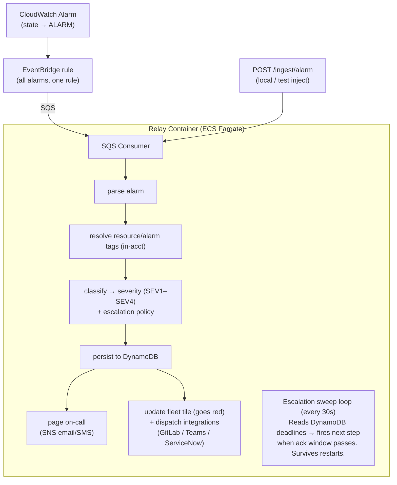
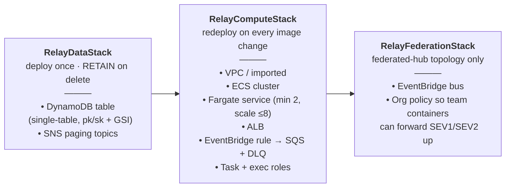
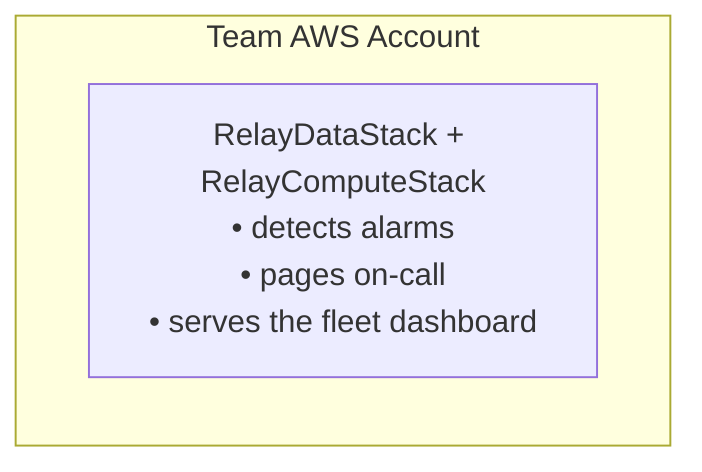
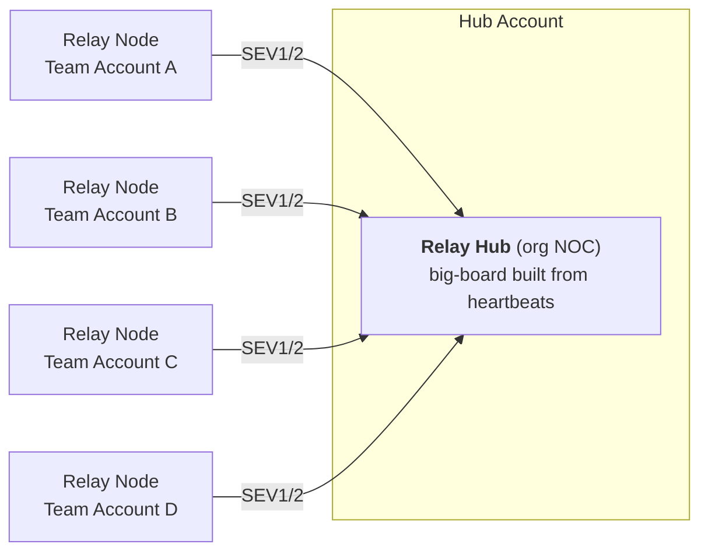

# Relay Architecture

Relay is a self-hosted, AWS-native incident management platform that replaces AWS Incident Manager. It runs as a single always-on container — detection, escalation, paging, and the fleet dashboard all happen in one process, one log stream. Relay is Apache-2.0, never phones home, and is designed to be cloned and deployed by any team into their own AWS account.

---

## How an Incident Flows

The entire hot path runs in-process inside a single container. There is no second network hop between detection and paging.

**Routing classification** (Step 2) now reads rules from a DB-backed store (`DynamoRoutingRuleStore`) seeded from `routing.yaml` on first boot. The Node classifier caches the live rules with a short TTL and **fails open** to the `routing.yaml` config on any DynamoDB error or empty store — paging is never broken by a store outage. Rules are edited live via the Rules screen without a redeploy.

**Ignore rules** run as Step 3a in the in-process pipeline — after classify, before persist or page. A matching alarm is dropped entirely: no incident row, no page, no ticket, no federation, and no contribution to metrics. This is distinct from suppression (Step 3b), which rate-limits repeat firings but still creates an incident on the first firing of each window. Both checks are in `node/handler.py`; ignore rules are managed via the Rules screen and stored in DynamoDB. Routing rules follow the same seed → DynamoDB model and are managed in the Routing section of the same screen.

**Escalation timers** are durable DynamoDB deadlines, not a scheduler service. The container's sweep loop checks them every 30 seconds. A container restart or rolling redeploy does not lose an escalation in progress.

**Local/test injection**: `POST /ingest/alarm` runs the exact same pipeline without needing AWS EventBridge or a real alarm — useful for smoke-testing a fresh deployment or running Relay entirely offline.

**App liveness**: apps emit periodic heartbeats so a healthy-but-quiet app stays `LIVE` on the fleet board. An app that stops heartbeating transitions to `NO-SIGNAL` (tile goes red) independently of any alarm.

---

## Deployment Shape

Relay ships as three independent CDK stacks. Deploy them in order; each has a distinct lifecycle.

| Stack | When to deploy | What changes trigger a redeploy |
|---|---|---|
| RelayDataStack | Once per account/environment | Schema migrations (rare) |
| RelayComputeStack | Every release | New container image, config change |
| RelayFederationStack | Once, federated-hub only | Bus policy changes |

The DynamoDB table is a **single table per deployment** and holds incidents, escalation deadlines, contacts (PII), on-call schedule, fleet tiles, and runtime settings. The `RETAIN` deletion policy means the table survives a stack teardown.

---

## Topologies

### team (default)

One container and one table in the team's own AWS account. Detection, paging, escalation, and the full fleet dashboard all run there. No cross-account infrastructure required.

### federated-hub

The same container image is run a second time as an org-wide aggregator (NOC big-board). Team deployments forward SEV1/SEV2 incidents up to it over the federation bus (RelayFederationStack). The federated hub stores **no static catalog** — it builds the org hierarchy dynamically from the registration and heartbeat data that teams push up, so there is no central catalog to keep in sync.

A future roadmap item re-splits detection into a lightweight per-team component and a central aggregator, recovering the original distributed model at scale. That work is deferred, not abandoned.

---

## Design Principles

**One artifact, one process, one log stream.**
An incident's entire lifecycle — detection through resolution — is visible in a single container's logs. There are no cross-service trace IDs to correlate.

**Durable escalation without a scheduler service.**
Escalation state lives as deadline records in DynamoDB. The sweep loop is the only timer. This means a rolling deploy or a task replacement does not silently drop an in-flight escalation.

**AWS-native and self-hosted.**
Relay uses EventBridge, SQS, ECS, DynamoDB, SNS, and ALB — all managed AWS primitives. It never phones home. All data stays in your account.

**Core domain logic is AWS-free.**
Detection, routing, and escalation are implemented behind adapter interfaces. AWS services, integration targets (GitLab, Teams, ServiceNow), and AI providers are pluggable. This keeps the core testable in isolation and makes future infrastructure changes non-breaking.

**Zero static catalog at the hub.**
In federated-hub topology, the hub never holds a curated list of apps. Org structure and app metadata arrive via team heartbeats, so the big-board is always consistent with what is actually deployed.

**Apache-2.0, no vendor lock-in.**
The container image is built from source you own. There is no hosted service, no license server, no telemetry.

---

## Further Reading

For the code-verified state of every feature, see `status.md`. For a feature-by-feature comparison against AWS Incident Manager, see `coverage.md`.
