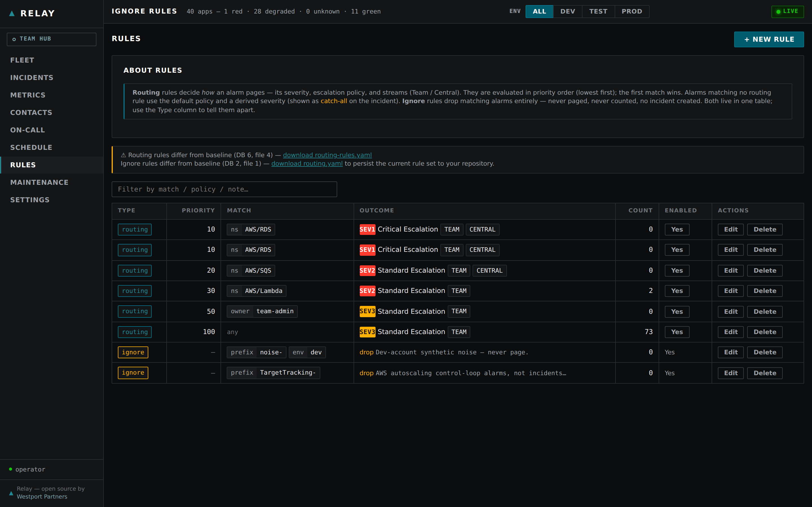

# Relay — Configuration Reference

This is the authoritative reference for configuring a Relay deployment. It covers the config-as-code YAML files, all runtime environment variables the container reads, and the CDK context keys set at deploy time.

---

## The config-as-code model

Operational rules live in Git as YAML files. Contacts, schedules, and PII never go in Git.

| What | Where it lives | Why |
|---|---|---|
| Escalation policies | `config/escalation.yaml` (Git) | Reviewed via merge request; reproducible |
| Routing rules | `config/routing.yaml` (Git) | Reviewed via merge request; reproducible |
| Org hierarchy / environments / catalog seed | `config/*.yaml` (Git, optional) | Structural metadata; no PII |
| Contact name, email, phone number | DynamoDB only | PII — never committed |
| On-call schedule | DynamoDB only | Changes without a redeploy |
| Ignore rules | DynamoDB (runtime); `routing.yaml` `ignore:` is a startup seed only | UI-managed; instant edits without redeploy; download regenerated YAML to re-sync Git |
| Routing rules (`rules:` block) | DynamoDB (runtime); `routing.yaml` `rules:` is a startup seed only | Same model as ignore rules — UI-managed; DB wins over config at runtime; fail-open to config on DynamoDB error |

Escalation policies page by **role** (`primary`, `secondary`, `manager`). The schedule resolves a role to the person on call at page time. Config files reference opaque `contact_id` values only — no names, no phone numbers.

---

## Config files

All config files live in the `config/` directory. Copy the `.example.yaml` files to the real names before deploying:

```
cp config/escalation.example.yaml  config/escalation.yaml
cp config/routing.example.yaml     config/routing.yaml
```

| File | Required | Purpose |
|---|---|---|
| `escalation.yaml` | Yes | Escalation policies: ordered steps, roles/channels, ack timeouts |
| `routing.yaml` | Yes | Priority-ordered rules mapping alarm metadata → severity + policy |
| `hierarchy.yaml` | No | Org hierarchy levels + global `deployment_defaults.tag_map` |
| `environments.yaml` | No | Environment names, OU paths, regex conventions for env derivation |
| `catalog.yaml` | No | Node-side org_path seed; the federated Hub builds its catalog dynamically from heartbeats and stores no static catalog, so this file is largely optional |

### escalation.yaml

Defines one or more named policies. Each policy is a list of steps; a step fires when the previous step's `ack_timeout_minutes` elapses without acknowledgment. The final step may set `terminal: true` (stop escalating) or `repeat_every_minutes` (keep paging).

```yaml
escalation_policies:

  - name: p1-critical
    severity: SEV1
    description: "Critical outage — fastest escalation, all hands available"

    steps:
      - step: 1
        label: "Page primary on-call"
        notify:
          role: primary          # resolved from the schedule at page time
          channel: [sms, email]  # both channels fired in parallel
        ack_timeout_minutes: 5

      - step: 2
        label: "Escalate to secondary on-call"
        notify:
          role: secondary
          channel: [sms, email]
        ack_timeout_minutes: 5

      - step: 3
        label: "Escalate to engineering manager"
        notify:
          role: manager
          channel: [sms, email]
        ack_timeout_minutes: 10

      - step: 4
        label: "Repeat page — all contacts"
        notify:
          roles: [primary, secondary, manager]
          channel: [sms, email]
        repeat_every_minutes: 15
```

Valid `role` values: `primary`, `secondary`, `manager`. Valid `channel` values: `sms`, `email`. A step may notify a single `role` or a list under `roles`.

Escalation state is driven by DynamoDB timers — no polling, no cron jobs.

### routing.yaml

Rules are evaluated in ascending `priority` order (lower number first); **first match wins**. Every rule requires an integer `priority`, and the rule list must be sorted ascending — the config validator rejects an out-of-order list. An empty `match: {}` is a wildcard (give it the highest `priority` number so it acts as the final catch-all). Match fields are all optional; unspecified fields are wildcards.

```yaml
routing_rules:

  - name: database-critical
    description: "RDS / Aurora production alarms"
    priority: 10
    match:
      namespace: "AWS/RDS"
      alarm_tags:
        Environment: production
    route:
      severity: SEV1
      escalation_policy: p1-critical
      streams: [team, central]

  - name: api-latency-high
    description: "API Gateway latency threshold breached"
    priority: 20
    match:
      namespace: "AWS/ApiGateway"
      alarm_name_prefix: "prod-"
    route:
      severity: SEV2
      escalation_policy: p2-high
      streams: [team, central]

  - name: default
    description: "Unmatched alarm — treat as SEV2"
    priority: 1000
    match: {}
    route:
      severity: SEV2
      escalation_policy: p2-high
      streams: [team, central]
```

**Rule fields:**

| Field | Type | Description |
|---|---|---|
| `name` | string | Unique rule identifier |
| `priority` | int ≥ 0 | Evaluation order — **lower number is evaluated first**. The rule list must be sorted ascending. Required; no default |
| `description` | string | Human-readable note (optional) |

**Match fields** (all optional; unspecified fields are wildcards; multiple fields are ANDed):

| Field | Type | Description |
|---|---|---|
| `alarm_name_prefix` | string | Matches the start of the CloudWatch alarm name |
| `alarm_name_pattern` | glob | Glob pattern matched against the full alarm name |
| `namespace` | string | CloudWatch metric namespace (e.g. `AWS/RDS`, `AWS/Lambda`) |
| `alarm_tags` | map | Key/value tags on the alarm's resource (requires tag resolution IAM) |
| `source` | string | `cloudwatch` or `synthetic` (CloudWatch Synthetics canary) |

**Route fields:**

| Field | Values | Description |
|---|---|---|
| `severity` | `SEV1`–`SEV4` | Severity tier assigned to the incident |
| `escalation_policy` | string | Name of a policy defined in `escalation.yaml` |
| `streams` | list | Which notification streams fire: `team`, `central`, or both |
| `tags` | map | Extra metadata tags attached to the incident |

> **`streams` is the first noise lever.** Whether an alarm is *eligible* to reach a Hub at all is decided per-rule here: a rule with `streams: [team]` never federates, no matter its severity. Use it to keep predictable low-value alarms (non-prod, chatty health checks) team-local.

> **Routing rules are also UI-managed.** The `rules:` block in `routing.yaml` is a **startup seed only** — the same model as ignore rules. On first boot, if the DynamoDB routing-rules store is empty, Relay seeds it from `routing.yaml`; thereafter DynamoDB is the runtime source of truth and the Rules screen edits it directly ("DB wins"). A changed `routing.yaml` on restart does **not** clobber live UI edits. The Node classifier reads DB rules via a short in-memory cache (see `RELAY_ROUTING_RULES_TTL_SECONDS` below) and **fails open** to the `routing.yaml` config on any DynamoDB error or empty store — paging is never broken by a store outage. Use `GET /routing-rules/download` to regenerate a `rules:` block from the live DB state you can paste back into `routing.yaml`.

#### Federation gate (`federation:`)

For deployments where this team's Hub forwards **up to a central (federated) Hub** (`RELAY_HUB_SCOPE=local-federated`), the `federation:` block in `routing.yaml` governs which incidents cross that second hop. This keeps the org-wide noise budget version-controlled alongside routing. The block is optional: when absent, the gate uses built-in defaults (`min_severity: SEV2`, all states, no overrides). There are no environment-variable equivalents — config is the only path.

```yaml
federation:
  min_severity: SEV2              # global gate: only SEV2-or-worse federates
  forward_states: [TRIGGERED, ESCALATED]   # optional; omit = all states
  overrides:                      # first match wins (file order)
    - name: noisy-batch-app
      app_name: batch-reports
      forward: never              # this app never federates, any severity
    - name: db-aggressive
      alarm_name_prefix: rds-
      min_severity: SEV3          # forward DB alarms down to SEV3
    - name: vip-tenant
      tags: { tier: "1" }
      forward: always             # tier-1 always federates (bypasses gate)
```

**Top-level fields:**

| Field | Values | Description |
|---|---|---|
| `min_severity` | `SEV1`–`SEV4` | Global threshold; an incident at or above this severity federates. Default `SEV2` |
| `forward_states` | list | If set, only these lifecycle states federate (e.g. `TRIGGERED`, `ESCALATED`). Omit/empty = all states |
| `overrides` | list | Per-app/tag exceptions, evaluated in file order; **first match wins** |

**Override match fields** (all optional, ANDed together):

| Field | Description |
|---|---|
| `app_name` | Exact match on the incident's app name |
| `alarm_name_prefix` | The alarm name must start with this string |
| `environment` | Exact match on the incident's environment |
| `tags` | All key/value pairs must be present in the incident's tags |

**Override actions:**

| Field | Effect |
|---|---|
| `forward: never` | Matched incidents never federate, regardless of severity |
| `forward: always` | Matched incidents always federate (bypasses `min_severity`) — still respects `forward_states` |
| `min_severity` | A slice-specific threshold replacing the global one for matched incidents |

> The `federation:` gate controls only the **local Hub → central Hub** hop. It never suppresses the team page (the `team` stream) or the local big-board tile — a team always sees its own incidents; federation only decides what the central NOC sees.

#### Noise suppression (`suppression:`)

The `federation:` and `streams` levers decide *where* an incident goes. The optional `suppression:` block decides whether a repeat firing becomes an incident **at all** — Node-side dedup, rate-limiting, and flap damping. It runs before the incident is persisted or paged, so a suppressed re-fire creates no incident row, no page, no ticket, and no federated event.

All three behaviours are one windowed-counter knob — "how many times has this logical alarm fired in the current window?":

- **Dedup** — `max_per_window: 1`: only the first firing in the window pages; re-fires are suppressed.
- **Rate-limit** — `max_per_window: N`: at most N pages per window.
- **Flap damping** — the same knob tuned tight (short window, low N) tames an alarm oscillating across its threshold.

```yaml
suppression:
  enabled: true
  window_seconds: 300           # 5-minute window
  max_per_window: 1             # dedup: one page per alarm per window
  exempt_severities: [SEV1]     # critical alarms always page (default)
  rules:                        # per-app/tag overrides; first match wins
    - name: chatty-healthcheck
      alarm_name_prefix: hc-
      window_seconds: 60
      max_per_window: 1         # throttle health-check flapping hard
    - name: batch-app
      app_name: batch-reports
      max_per_window: 5         # allow a few, then quiet (keeps global window)
```

**Top-level fields:**

| Field | Values | Description |
|---|---|---|
| `enabled` | bool | Master switch. Default `false` (no suppression) |
| `window_seconds` | int > 0 | Length of the fixed counting window. Default `300` |
| `max_per_window` | int ≥ 1 | Incidents allowed per window before suppression kicks in. Default `1` (dedup) |
| `exempt_severities` | list | Severities that always page, never suppressed. Default `[SEV1]` |
| `rules` | list | Per-app/tag overrides of `window_seconds` / `max_per_window`; first match wins |

**Rule match fields** are the same as the federation overrides: `app_name`, `alarm_name_prefix`, `environment`, `tags` (all optional, ANDed). A rule may override `window_seconds`, `max_per_window`, or both; unset fields fall back to the global value.

The dedup key is `account_id + app_name + alarm_name` — one logical alarm, regardless of how many raw state-changes CloudWatch emits.

> **Fail-open.** If the counter store is unreachable, the incident is *not* suppressed — noise control never blocks a real page. And `SEV1` (or whatever you list in `exempt_severities`) always pages even while flapping.

#### Ignore rules (`ignore:`)

**Suppression vs. ignore** — the key difference:

- **`suppression:`** is a rate-limiter. It silences *repeat* firings within a window, but the first firing in each window still creates an incident, pages on-call, creates tickets, and federates up. It is the right tool for flapping or chatty alarms that occasionally do warrant attention.
- **Ignore rules** drop a matching alarm entirely — no incident row, no page, no ticket, no federated event, and the alarm is excluded from all metric rollups (MTTR, counts, DORA). Use ignore rules for alarms you have decided require *no response*, ever.

**Storage model.** The optional `ignore:` block in `routing.yaml` is a **startup seed only**. On first boot, if the DynamoDB rules store is empty, Relay populates it from `routing.yaml`; thereafter DynamoDB is the runtime source of truth. The UI edits DynamoDB directly — changes are instant and require no config file change or redeploy. A changed `routing.yaml` on restart does **not** clobber live UI edits ("DB wins").

**Primary management path.** Use the **Rules** screen in the dashboard. It lists all live ignore rules with per-rule trigger counts, reason/note, created_by, and created_at. From there you can create, edit, filter, and delete rules. The screen also shows a banner when the live rules differ from the `routing.yaml` baseline, and offers a YAML download (`GET /ignore-rules/download`) of a regenerated `ignore:` block you can paste back into `routing.yaml` to persist the changes.

<figure class="screenshot" markdown="span">
  
  <figcaption>When the live DynamoDB rules drift from the <code>routing.yaml</code> seed, the Rules screen shows a deviation banner. Download YAML regenerates the block to paste back into Git and re-sync the two.</figcaption>
</figure>

The `ignore:` block in `routing.yaml` follows this schema (fields match the UI form):

```yaml
ignore:
  enabled: true
  rules:
    - name: idle-vm-low-cpu
      account_id: "123456789012"    # optional — omit to match any account
      app_name: ec2-fleet           # optional — exact match on app name
      alarm_name: EC2-CPU-Low       # optional — exact alarm name
      alarm_name_prefix: EC2-CPU-   # optional — alarm name starts with
      environment: dev              # optional — exact match on environment
      tags:                         # optional — all key/value pairs must match
        relay:ignore: "true"
      note: "Low-CPU idle alarm — no action needed"
      enabled: true
```

**Rule match fields** (all optional; unspecified fields are wildcards; multiple fields are ANDed):

| Field | Description |
|---|---|
| `account_id` | AWS account ID of the alarm's source account |
| `app_name` | Exact match on the incident's app name |
| `alarm_name` | Exact match on the CloudWatch alarm name (precise match) |
| `alarm_name_prefix` | Alarm name must start with this string (broader match) |
| `environment` | Exact match on the incident's environment |
| `tags` | All key/value pairs must be present in the incident's tags |
| `note` | Human-readable reason stored with the rule (not a match field) |
| `enabled` | `true`/`false`; disabled rules are stored but never matched |

> The Ignore action in the incident drawer pre-fills a rule from the open incident (precise match by default). You can broaden it to `alarm_name_prefix` or whole-app/env before saving. Creating the rule also auto-resolves the triggering incident with a "ignored" timeline event.

**Shipped default.** The stock `routing.yaml` / `routing.example.yaml` ship one default ignore rule, `aws-autoscaling-target-tracking` (`alarm_name_prefix: "TargetTracking-"`). AWS auto-creates target-tracking alarms to drive autoscaling; they flip to `ALARM` as normal scaling control-loop behavior — including Relay's own hub service scaling down when idle — and are never a real incident. The default keeps a fresh install from paging on its own (and the monitored account's) autoscaling activity. Remove it via the Rules screen if you do want those alarms.

---

## Config source

Set `RELAY_CONFIG_SOURCE` to control where the container loads YAML from.

### `local` (default for air-gapped / simple deploys)

The container reads YAML from `RELAY_CONFIG_DIR` (default: `config`). A config change requires rebuilding and redeploying the image (the config directory is baked in at build time or volume-mounted). No external dependencies.

### `gitlab`

The container fetches YAML from a GitLab repository at startup and caches it in memory. It refreshes the cache periodically or on reload — there is no webhook to configure. Set `RELAY_GITLAB_REPO` (project ID or path) and store a GitLab personal access token in Secrets Manager under `RELAY_GITLAB_SECRET_NAME` (default: `relay/gitlab-token`). This mode enables merge-request review workflows without rebuilding the image on every config change.

> **Note:** There is no "Node Lambda." Relay is a single always-on container. Config is loaded at container startup and refreshed in-process.

---

## Severity tiers

Tiers are assigned by `routing.yaml` and drive escalation timing and channel selection.

| Tier | Label | Default ack window | Escalation behavior |
|---|---|---|---|
| SEV1 | Critical | ~5 min | Fast page; escalates to secondary then manager; repeating pages until acked |
| SEV2 | High | ~15 min | Pages primary and secondary; manager escalation at ~65 min |
| SEV3 | Warning | —  | Email / team-stream notification only; no SMS page |
| SEV4 | Low / Informational | — | Logged; no page, no email |

### Controlling team-paging noise

The team page is intentionally *not* severity-gated by a single global knob — a team should see its own incidents. Instead, you tune team-level noise compositionally with the config you already have:

1. **Route low-value alarms to a quiet escalation policy.** Point a routing rule at a policy whose first step is email-only (no SMS) or whose final step is `terminal: true` (notify once, never repeat). The `p3-low` policy in `escalation.example.yaml` is the template.
2. **Set the severity tier deliberately.** A rule that assigns `SEV4` logs the incident without paging at all (see the table above); `SEV3` notifies the team stream without an SMS page.

So team-paging volume is a routing-rule → escalation-policy pairing, federation volume is the `federation:` block, repeat-firing noise (dedup / rate-limit / flapping) is the `suppression:` block, and alarms that require *no response at all* are the `ignore:` block / Rules screen — independent levers, all in `routing.yaml` / `escalation.yaml` (config-as-code seed) or the UI (DynamoDB runtime).

---

## Environment variables

The container reads the following environment variables at startup. Variables with no default are required unless marked optional.

### Core / table

| Variable | Controls | Default |
|---|---|---|
| `RELAY_TABLE_NAME` | The team's DynamoDB table (contacts, incidents, escalation state) | *(set by deploy — no default)* |
| `RELAY_FLEET_TABLE_NAME` | Fleet/incidents table; in a team deploy, same as `RELAY_TABLE_NAME` | `relay-hub-fleet` |
| `AWS_REGION` / `AWS_DEFAULT_REGION` | AWS region | `us-east-1` |
| `RELAY_AWS_ENDPOINT_URL` | Override the AWS endpoint (e.g. `http://localhost:8000` for DynamoDB Local) | *(none)* |

### Runtime

| Variable | Controls | Default |
|---|---|---|
| `RELAY_RUNTIME` | `fargate` \| `local-aws` \| `local-mock` — controls SQS consumer on/off and ingest-endpoint gating | `fargate` |
| `RELAY_ALLOW_INGEST` | When `"true"`, opens `POST /ingest/alarm` even in fargate mode | `false` |
| `LOG_LEVEL` | `DEBUG` \| `INFO` \| `WARNING` \| `ERROR` | `INFO` |
| `RELAY_TZ` | IANA timezone for schedule resolution (e.g. `America/New_York`) | `UTC` |

### Ingress / paging

| Variable | Controls | Default |
|---|---|---|
| `RELAY_SQS_QUEUE_URL` | SQS ingress queue URL; if empty, the SQS consumer does not start (inject-only mode) | *(empty)* |
| `RELAY_SNS_TOPIC_ARN` / `RELAY_CENTRAL_PAGING_TOPIC_ARN` | SNS topic for team paging | *(none)* |

### Rules cache (DB-backed routing and ignore)

| Variable | Controls | Default |
|---|---|---|
| `RELAY_ROUTING_RULES_TTL_SECONDS` | How long the Node classifier caches routing rules fetched from DynamoDB before re-reading. Lower values pick up UI edits faster at the cost of slightly more DB reads. On any DynamoDB error or empty store the classifier falls back to the `routing.yaml` config (fail-open). | `30` |
| `RELAY_IGNORE_RULES_TTL_SECONDS` | Same cache TTL for the ignore-rule store. | `30` |

### Config source

| Variable | Controls | Default |
|---|---|---|
| `RELAY_CONFIG_SOURCE` | `local` \| `gitlab` \| *(empty = no config)* | *(empty)* |
| `RELAY_CONFIG_DIR` | Local config directory path | `config` |
| `RELAY_GITLAB_REPO` | GitLab project ID or path (enables `gitlab` source) | *(none)* |
| `RELAY_GITLAB_SECRET_NAME` | Secrets Manager secret holding the GitLab token | `relay/gitlab-token` |
| `RELAY_GITLAB_BASE_URL` | Self-hosted GitLab base URL | `https://gitlab.com` |

### Auth (UI write-gating)

| Variable | Controls | Default |
|---|---|---|
| `RELAY_AUTH_MODE` | `none` — read-only, all writes return 403 \| `alb` — trust ALB OIDC headers \| `dev` — fixed dev user (never in production) | `none` |
| `RELAY_DEV_USER` | Fixed identity when `auth_mode=dev` | `dev` |

### AI (optional)

| Variable | Controls | Default |
|---|---|---|
| `RELAY_AI_ENABLED` | `"true"` to enable AI investigation features | `false` |
| `RELAY_AI_PROVIDER` | `bedrock` \| `bedrock-converse` \| `openai` \| `claude-code` | `bedrock` |
| `RELAY_AI_MODEL_ID` | Provider model ID | *(none)* |
| `RELAY_AI_BASE_URL` | Base URL for OpenAI-compatible endpoints | *(none)* |
| `RELAY_AI_API_KEY_SECRET` | Secrets Manager secret holding the API key (OpenAI-compatible providers) | *(none)* |

### Integrations (optional)

| Variable | Controls |
|---|---|
| `RELAY_SERVICENOW_INSTANCE_URL` | ServiceNow instance URL |
| `RELAY_SERVICENOW_USERNAME` | ServiceNow username |
| `RELAY_SERVICENOW_SECRET` | Secrets Manager secret for the ServiceNow password |
| `RELAY_GITLAB_ENV_TIER_MAP` | Maps Relay environment names to GitLab DORA deployment tiers |
| `RELAY_ENABLE_DIRECT_SMS` | Context key — grants `sns:Publish` for direct-to-phone SMS (gated; set at deploy time) |

See `integrations.md` for configuration detail on each integration.

### Node self-identity (tile identity on the Hub board)

| Variable | Controls | Default |
|---|---|---|
| `RELAY_NODE_APP_NAME` | Application name shown on the Hub tile | Falls back to team name |
| `RELAY_NODE_DEPLOYMENT_ID` | Deployment identifier | *(none)* |
| `RELAY_NODE_ENVIRONMENT` | Environment label for unrouted events | *(none)* |
| `RELAY_NODE_SERVICE_PATH` | Service path string | *(none)* |
| `RELAY_NODE_ORG_PATH` | Org hierarchy path (e.g. `product-line/product/component`) | *(none)* |

### Federation

| Variable | Controls | Default |
|---|---|---|
| `RELAY_HUB_SCOPE` | `local` — a single team node \| `local-federated` — team node that also forwards up to a Hub \| `central` — the federated Hub | `local` |
| `RELAY_UPSTREAM_HUB_BUS_ARN` | ARN of the upstream EventBridge bus (required when `hub_scope=local-federated`) | *(none)* |

> **Federation forwarding is config-only.** Which incidents forward to the central Hub is governed entirely by the `federation:` block in `routing.yaml` (see [Federation gate](#federation-gate-federation)). There are no `RELAY_FORWARD_*` environment variables — they were removed in favor of version-controlled config.

---

## CDK context keys

CDK context keys (`relay:*`) are set at deploy time. Most operators set these by exporting `RELAY_*` shell environment variables before running the deploy scripts, which translate them into `-c relay:*` CDK context flags automatically. See `deploy.md` for the full variable-to-context mapping.

The table below is a quick reference for operators who set context keys directly.

| Context key | Controls |
|---|---|
| `relay:role` | `node` or `hub` — which stack topology to deploy |
| `relay:team_name` | Team identifier; used for resource naming |
| `relay:hub_image_uri` | Container image URI **(required; deploy fails fast without it)** |
| `relay:org_id` | AWS Organizations ID (used for cross-account trust) |
| `relay:hub_scope` | Maps to `RELAY_HUB_SCOPE` |
| `relay:central_hub_bus_arn` | Maps to `RELAY_UPSTREAM_HUB_BUS_ARN` |
| `relay:vpc_id` | VPC for the ECS task |
| `relay:ecs_task_role_arn` | Bring-your-own task role ARN |
| `relay:ecs_execution_role_arn` | Bring-your-own execution role ARN |
| `relay:config_source` | Maps to `RELAY_CONFIG_SOURCE` |
| `relay:tz` | Maps to `RELAY_TZ` |
| `relay:log_level` | Maps to `LOG_LEVEL` |
| `relay:auth_mode` | Maps to `RELAY_AUTH_MODE` |
| `relay:dev_user` | Maps to `RELAY_DEV_USER` |
| `relay:ai_enabled` / `relay:ai_provider` / `relay:ai_model_id` / `relay:ai_base_url` / `relay:ai_api_key_secret` | AI feature configuration |
| `relay:servicenow_instance` | ServiceNow integration |
| `relay:gitlab_secret_name` | GitLab token secret |
| `relay:enable_integrations` | Enable optional integrations |
| `relay:enable_direct_sms` | Grant direct-to-phone SMS IAM permission |
| `relay:resolve_alarm_tags` | Grant IAM to resolve alarm/resource tags |
| `relay:app_name` / `relay:deployment_id` / `relay:environment` / `relay:service_path` / `relay:org_path` | Node self-identity |

---

## Managing contacts

Contacts (name, email, phone) and the on-call schedule are **not** managed in YAML. They are stored in DynamoDB and managed through:

- The Relay web UI (Contacts and Scheduling screens)
- The seed script: `scripts/relay-seed-contacts.sh` (for bulk import / initial setup)

See `operate.md` for day-to-day contact management and `scheduling.md` for setting up on-call schedules.
