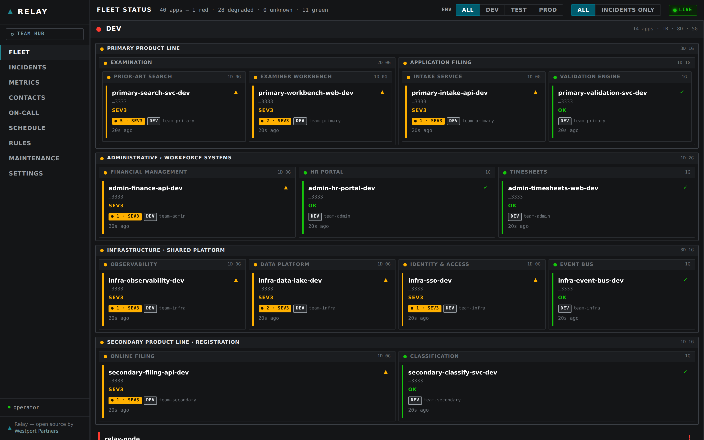
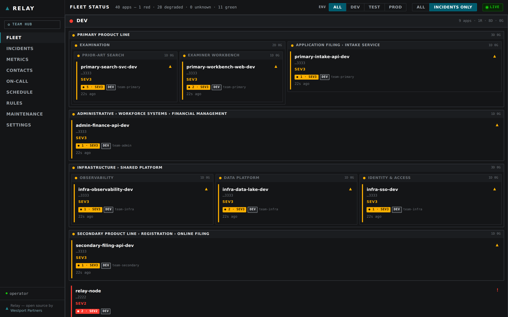
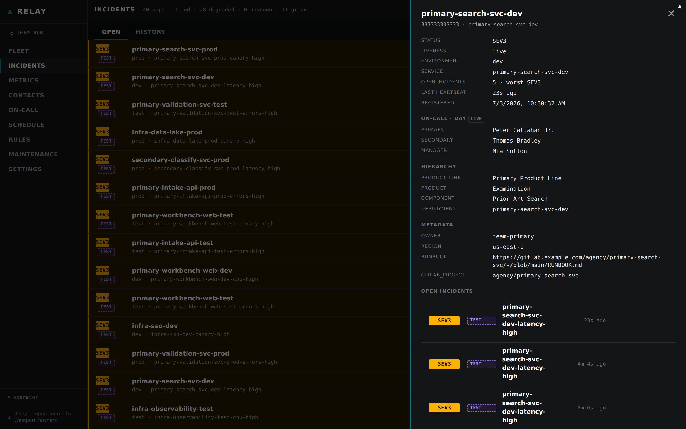
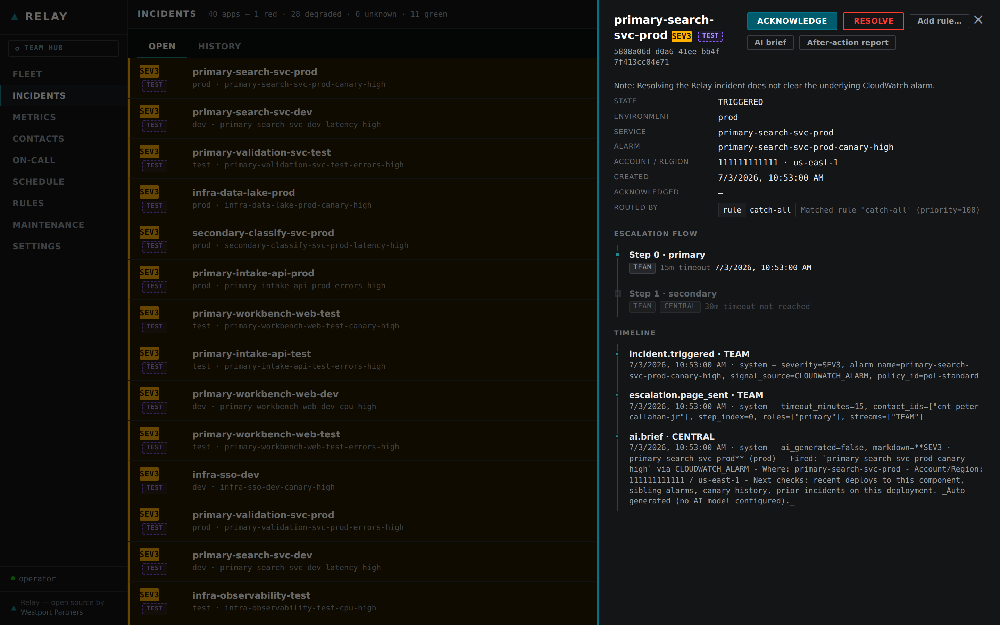
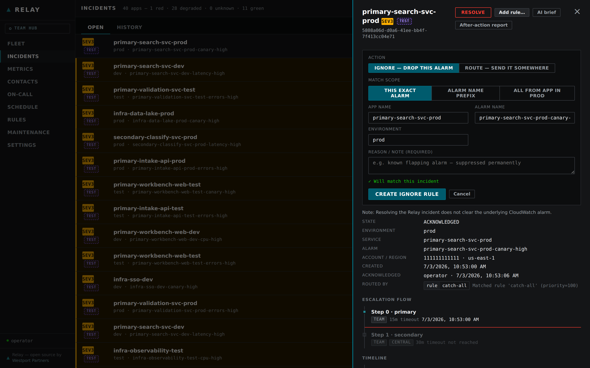
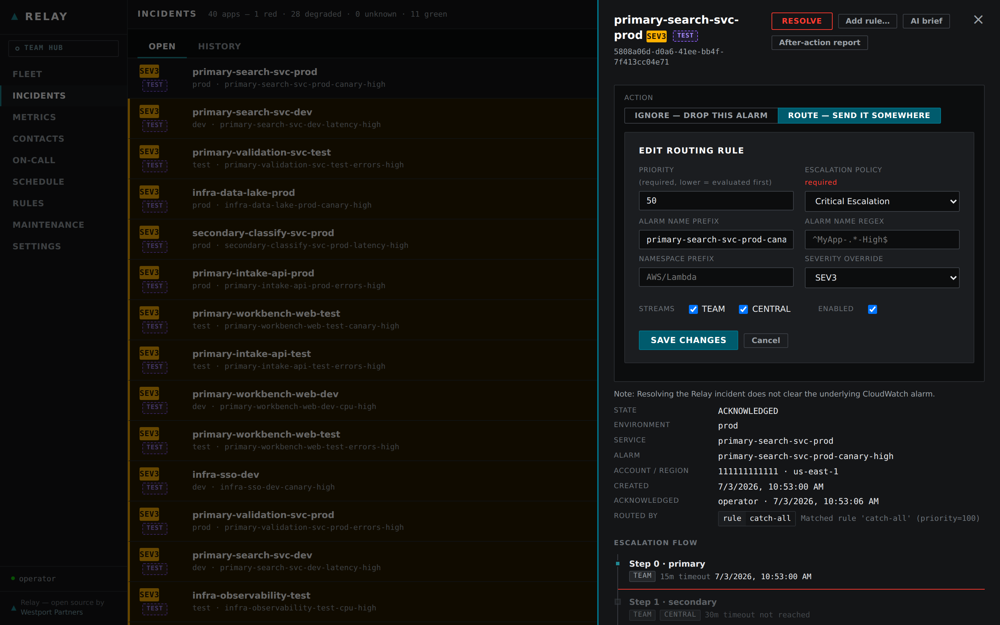
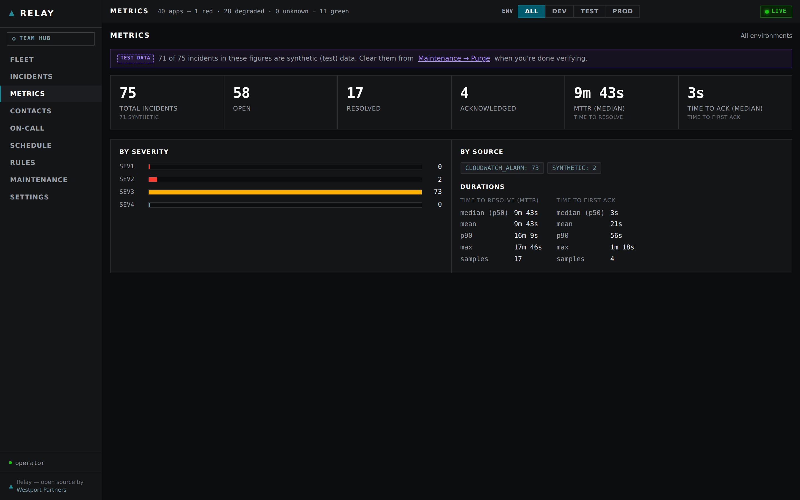

# Operating Relay

The dashboard is the primary interface for running Relay day to day. It is served by the always-on container and reflects the live state of your fleet — incidents, health, on-call contacts, and metrics — without requiring any manual refresh.

---

## Accessing the Dashboard

Open the `DashboardUrl` output from your deployed stack (CloudFormation or CDK). Locally the container listens on port 8080.

**Auth modes** — controlled by `RELAY_AUTH_MODE`:

| Mode | Behavior |
|------|----------|
| `none` | Default. Dashboard is read-only; all write endpoints return 403. Safe for internal networks. |
| `alb` | Production mode. OIDC authentication enforced by the ALB. Writes are permitted for authenticated users. |
| `dev` | Local development. A fixed dev user is injected; writes are enabled. |

See `configure.md` for how to set the auth mode and configure OIDC.

---

## The Fleet Big-Board

The landing view is a tile grid — one tile per tracked deployment across your entire fleet (designed for up to ~200 apps). Tiles are color-coded by current severity:

- **Green** — healthy, no open incidents
- **Yellow / Orange** — active incident at lower severity
- **Red** — active incident at SEV1 or SEV2, or no-signal (app is silent)

The board is kept live by a server-sent events (SSE) stream (`GET /stream`). The container pushes fleet snapshots and deltas on roughly a 30-second cycle. Tiles update in place — no page reload needed.

<figure class="screenshot" markdown="span">
  
  <figcaption>The big-board nests the org hierarchy — product line › product › component › deployment — inside the environment lens. Each tile shows the app's current severity, open-incident count, environment badge, owning team, and last-seen age.</figcaption>
</figure>

### Liveness and signal loss

Apps emit periodic heartbeats. Relay tracks each app's last-seen time:

- **LIVE** — heartbeat received within the expected window
- **STALE** — heartbeat overdue; the app may be degraded or its agent is not running
- **LOST (NO-SIGNAL)** — no heartbeat for an extended period; the tile turns red

A truly dead app is visible on the board, not invisible. This is a key difference from systems that only show apps when an alarm fires.

### Environment filter

The top strip carries a global **environment lens** — a sticky control offering `ALL / prod / test / dev` (default `ALL`). It scopes the Fleet board, the Incidents list, and the Metrics view to a single environment at once. Environment sits *above* the org hierarchy, so the lens composes with the Fleet "Incidents only" filter and the org grouping rather than replacing them.

The selection is remembered in your browser and stays applied as you move between views and across a full reload. Newly arriving incidents and tile updates honor the active environment without re-selecting. Under a specific environment the Metrics view recomputes its KPIs from the in-scope incidents; under `ALL` it shows the whole-fleet figures.

This is a view lens over the data one hub already holds — it does not change which environments a hub is responsible for, and it is not a security boundary.

<figure class="screenshot" markdown="span">
  
  <figcaption>The "Incidents only" filter (top strip) collapses the board to just the deployments with open incidents — the environment lens and org grouping still apply on top.</figcaption>
</figure>

---

## The Tile Detail Drawer

Click any tile to open a data-driven detail drawer for that deployment. Sections render only when data is present:

- **On-call now** — who is currently paged for this app (primary, secondary, manager), resolved from the schedule at the moment you open the drawer. For a federated hub topology this is the owning team's pushed on-call snapshot.
- **Org hierarchy / metadata** — product line, product, component, and deployment identifiers.
- **AWS resource tags** — tags pulled from the deployment's registered resources.
- **Open incidents** — list of active incidents with severity and age.

<figure class="screenshot" markdown="span">
  
  <figcaption>One click on a tile opens a full context card: who is on call right now (primary / secondary / manager), the org hierarchy, AWS metadata and runbook link, and the deployment's open incidents.</figcaption>
</figure>

---

## Incident Detail and Lifecycle

Click an incident (from the tile drawer or the incidents list) to open its detail view. The view shows:

- **Timeline** — append-only audit trail of every state change, page, acknowledgement, and note
- **Properties** — severity, triggering alarm or signal, affected deployment
- **Actions** — Acknowledge, Resolve, Ignore (see below)
- **AI briefing pack** — available when AI is enabled; a synthesized summary of the incident context
- **AI after-action review (AAR)** — available post-resolution when AI is enabled

<figure class="screenshot" markdown="span">
  
  <figcaption>Selecting an incident opens its detail drawer beside the list: severity, environment, triggering alarm, routed-by rule, the live escalation flow, and an append-only timeline. Acknowledge / Resolve / Add rule act in place.</figcaption>
</figure>

### Incident states

```
TRIGGERED → ACKNOWLEDGED → (ESCALATED) → RESOLVED → CLOSED
```

| State | Meaning |
|-------|---------|
| `TRIGGERED` | Alarm received; escalation policy starts |
| `ACKNOWLEDGED` | Someone claimed the incident; escalation stops |
| `ESCALATED` | No acknowledgement within the step timeout; next escalation step fired |
| `RESOLVED` | Incident closed; external tickets (GitLab / ServiceNow) closed automatically |
| `CLOSED` | Terminal state; contributes to MTTR metrics |

---

## Acknowledging, Resolving, and Ignoring

**Acknowledge** an incident from the incident detail view (or `POST /incidents/{id}/acknowledge`). Acknowledging immediately cancels the pending escalation timer — no further pages are sent. It signals that a human has the incident.

**Resolve** an incident from the detail view (or `POST /incidents/{id}/resolve`). Resolving:

- Closes any linked GitLab issue or ServiceNow record
- Drives time-to-restore and MTTR calculations in the metrics view
- Moves the incident to `CLOSED`

**Ignore** an incident from the detail view (the **Ignore…** button, or `POST /incidents/{correlation_id}/ignore`). Ignoring:

- Creates a persistent ignore rule pre-filled from the incident (precise match by default; you can broaden it to `alarm_name_prefix` or whole-app/env before saving)
- Auto-resolves the triggering incident with an "ignored" timeline event
- Causes all future alarms that match the rule to be **dropped at the Node** before they become incidents — no incident row, no page, no ticket, no federation, and no contribution to metrics

<figure class="screenshot" markdown="span">
  
  <figcaption>The <strong>Ignore</strong> form opens pre-filled from the triggering alarm — a precise match by default, which you can broaden to a prefix or the whole app/environment before saving.</figcaption>
</figure>

**Route** an incident from the detail view (the **Routing…** button, or `POST /incidents/{id}/route`). This opens a form pre-filled from the triggering alarm to create a routing rule on the fly. Unlike Ignore, creating a routing rule **does not** auto-resolve the incident — the current incident continues normally. The new rule only affects **future** alarms that match. You can adjust the priority, match criteria, severity, escalation policy, and streams before saving.

<figure class="screenshot" markdown="span">
  
  <figcaption>The <strong>Route</strong> form (same panel, toggled from Ignore) creates a routing rule for future alarms — adjust priority, match, severity override, escalation policy, and streams. It does not resolve the current incident.</figcaption>
</figure>

All four actions require write access (auth mode `alb` or `dev`). In `none` mode the buttons are visible but the API returns 403.

---

## Rules screen (Routing rules and Ignore rules)

The **Rules** nav item opens the Rules management screen. It shows two labeled tables, reflecting the two runtime pipeline stages: an **Ignore rules** accordion first (collapsed by default — ignore rules drop matching alarms and override every routing rule, so they lead visually but stay low-profile), and a **Routing rules** accordion below (expanded by default — the list operators work with day to day). The single **+ New rule** button opens a form whose Type toggle picks routing or ignore.

<figure class="screenshot" markdown="span">
  
  <figcaption>The Rules screen lists every live rule stored in DynamoDB with its match count, so you can see which rules are actually firing. Ignore rules sit in a collapsed accordion whose header shows the rule count and aggregate alarms dropped; routing rules sit in the expanded table below. The Download YAML button round-trips runtime rules back into <code>routing.yaml</code>.</figcaption>
</figure>

### Routing rules table

Shows every live routing rule stored in DynamoDB. Columns:

- **Priority** — evaluation order; first match wins
- **Match criteria** — alarm name prefix/pattern, namespace, tags, source
- **Severity override** — the SEV tier assigned when this rule matches
- **Escalation policy** — the policy applied to the matched incident
- **Streams** — which notification streams fire (`team`, `central`, or both)
- **Match count** — how many alarms this rule has matched since it was created
- **Enabled** — toggle to disable a rule without deleting it
- Edit and delete controls per rule, and a **Create** button

**Deviation banner.** When the live DynamoDB rules differ from the `routing.yaml` `rules:` baseline (the seed loaded at container boot), the screen shows a banner. Use the **Download YAML** button (`GET /routing-rules/download`) to get a regenerated `rules:` block you can paste back into `routing.yaml`.

### Ignore rules table

Rendered in the collapsed-by-default accordion at the top; the header shows the rule count and the aggregate trigger count (total alarms dropped) so you can gauge suppression volume without expanding it. Ignore rules are binary — first match wins, no priority column. Shows every live ignore rule stored in DynamoDB with:

- **Match criteria** — alarm name prefix/pattern, namespace, tags, source
- **Outcome** — `drop`, plus the reason/note stored with the rule
- **Trigger count** — how many times the rule has dropped a matching alarm since it was created
- Enabled state, edit, and delete controls for each rule

**Deviation banner.** When the live DynamoDB rules differ from the `routing.yaml` `ignore:` baseline, the screen shows a banner. Use the **Download YAML** button (`GET /rules/download`) to get a regenerated `ignore:` block you can paste back into `routing.yaml`.

See `configure.md` for the full config schemas, the seed-vs-DynamoDB storage model for both rule types, and how ignore rules differ from `suppression:`.

---

## Metrics

`GET /metrics` (and the **Metrics** tab in the dashboard) exposes fleet-level KPIs:

- **MTTR** — mean time to resolve, across a rolling window
- **Time-to-ack** — mean time from trigger to first acknowledgement
- **Incident counts** — by severity and by time period

<figure class="screenshot" markdown="span">
  
  <figcaption>The Metrics view computes KPIs from resolved incidents. Switching the environment lens recomputes every figure for the in-scope environment.</figcaption>
</figure>

---

## Settings

The **Settings** screen stores integration credentials. All values are held in DynamoDB (not in config files).

| Setting | API | Notes |
|---------|-----|-------|
| MS Teams webhook URL | `PUT /settings/teams-webhook` | Relay posts incident notifications to this URL |
| Test Teams webhook | `POST /settings/teams-webhook/test` | Sends a test message |
| GitLab token | `PUT /settings/gitlab-token` | Token is stored masked; used for issue lifecycle |
| Test GitLab token | `POST /settings/gitlab-token/test` | Verifies token scope and connectivity |

---

## HTTP API Reference

All endpoints are served by the container. The base URL is the same as the dashboard URL.

> **Write endpoints** (marked below) require auth mode `alb` or `dev`. In `none` mode they return `403 Forbidden`. See `configure.md`.

### Core

| Method | Path | Purpose | Write? |
|--------|------|---------|--------|
| GET | `/` | Serve the dashboard SPA shell | |
| GET | `/static/dashboard/*` | Dashboard ES modules (read-only static; no build step) | |
| GET | `/health` | Container liveness check | |
| GET | `/stream` | SSE stream — fleet snapshots + deltas | |
| GET | `/config` | Runtime config visible to the frontend | |
| GET | `/auth` | Current auth identity | |

### Fleet

| Method | Path | Purpose | Write? |
|--------|------|---------|--------|
| GET | `/fleet` | All fleet tiles | |
| GET | `/fleet/rollup` | Org tree with rolled-up health | |
| GET | `/fleet/tile?account_id=&app_name=` | Single tile + live on-call (query params: `app_name` may contain `/`) | |

### Incidents

| Method | Path | Purpose | Write? |
|--------|------|---------|--------|
| GET | `/incidents` | Open incidents | |
| GET | `/incidents/history` | All incidents including resolved/closed | |
| GET | `/incidents/{id}` | Incident detail + full timeline | |
| GET | `/incidents/{id}/brief` | AI briefing pack | |
| GET | `/incidents/{id}/aar` | AI after-action review | |
| POST | `/incidents/{id}/acknowledge` | Acknowledge; halts escalation | Yes |
| POST | `/incidents/{id}/resolve` | Resolve; closes external tickets | Yes |
| POST | `/incidents/{id}/ignore` | Create ignore rule + auto-resolve | Yes |
| POST | `/incidents/{id}/route` | Create routing rule pre-filled from this alarm (does not resolve the incident) | Yes |

### Routing Rules

| Method | Path | Purpose | Write? |
|--------|------|---------|--------|
| GET | `/routing-rules` | List all live routing rules (with match counts) | |
| POST | `/routing-rules` | Create a routing rule | Yes |
| PUT | `/routing-rules/{id}` | Update a routing rule | Yes |
| DELETE | `/routing-rules/{id}` | Delete a routing rule | Yes |
| GET | `/routing-rules/deviation` | Check whether live DB rules differ from routing.yaml baseline | |
| GET | `/routing-rules/download` | Download regenerated `rules:` YAML block | |

### Escalation Policies

| Method | Path | Purpose | Write? |
|--------|------|---------|--------|
| GET | `/escalation-policies` | List all configured escalation policies (for UI dropdowns) | |

### Ignore Rules

| Method | Path | Purpose | Write? |
|--------|------|---------|--------|
| GET | `/rules` | List all live ignore rules (with trigger counts) | |
| POST | `/rules` | Create an ignore rule | Yes |
| PUT | `/rules/{rule_id}` | Update an ignore rule | Yes |
| DELETE | `/rules/{rule_id}` | Delete an ignore rule | Yes |
| GET | `/rules/deviation` | Check whether live rules differ from routing.yaml baseline | |
| GET | `/rules/download` | Download regenerated `ignore:` YAML block | |

### Metrics

| Method | Path | Purpose | Write? |
|--------|------|---------|--------|
| GET | `/metrics` | MTTR, time-to-ack, incident counts | |

### Contacts and On-Call

| Method | Path | Purpose | Write? |
|--------|------|---------|--------|
| GET | `/contacts` | All registered contacts | |
| POST | `/contacts` | Create a contact | Yes |
| DELETE | `/contacts/{id}` | Remove a contact | Yes |
| POST | `/contacts/{id}/test` | Send a test page to the contact | Yes |
| GET | `/oncall` | Who is on call right now (per role) | |
| GET | `/availability` | All availability grids | |
| PUT | `/availability/{contact_id}` | Update a contact's availability | Yes |

### Schedule

| Method | Path | Purpose | Write? |
|--------|------|---------|--------|
| GET | `/schedule` | Current week's schedule (optional `?week=`) | |
| POST | `/schedule/auto` | Auto-generate schedule for the week | Yes |
| GET | `/schedule/overrides` | All active overrides | |
| PUT | `/schedule/override` | Create or update an override | Yes |
| DELETE | `/schedule/override` | Delete an override | Yes |

### Settings

| Method | Path | Purpose | Write? |
|--------|------|---------|--------|
| GET | `/settings` | Current settings (tokens masked) | |
| PUT | `/settings/teams-webhook` | Store Teams webhook URL | Yes |
| POST | `/settings/teams-webhook/test` | Send a test Teams message | Yes |
| PUT | `/settings/gitlab-token` | Store GitLab token | Yes |
| POST | `/settings/gitlab-token/test` | Test GitLab token | Yes |

### Ingest (testing only)

| Method | Path | Purpose | Write? |
|--------|------|---------|--------|
| POST | `/ingest/alarm` | Inject a synthetic alarm | Yes (+ `RELAY_ALLOW_INGEST`) |

> `/ingest/alarm` is only available when `RELAY_ALLOW_INGEST=true`. It is intended for local development and smoke-testing, not production. See `local-dev.md` for usage.
